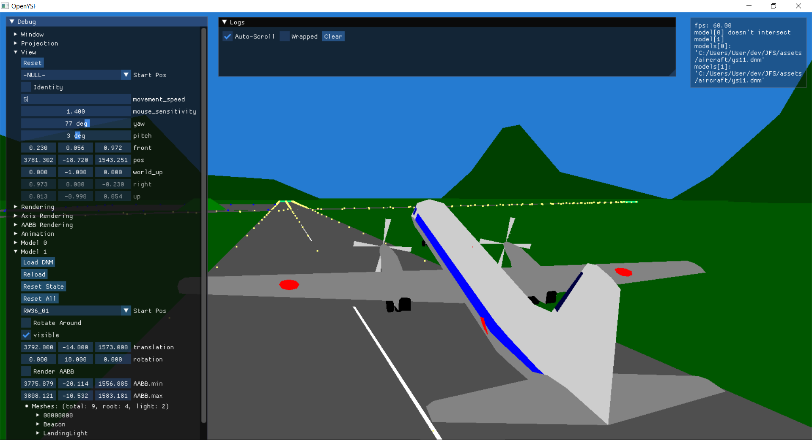

# OpenYSF
A [ysflight](https://ysflight.org/) clone, for learning and fun.
Aims to be backward compatible with ysflight assets



# Assets
OpenYSF uses assets from the original game.

1. [Download ysflight](https://ysflight.org/download/)
2. Copy all Ysflight files into `<repo>/assets`, so you end with `<repo>/assets/aircraft` and `<repo>/assets/ground` and so on

# Build Dependencies
- cmake 3.21.0
- C/C++ compiler (MSVC/Clang/GCC)

```sh
cmake -S. -Bbuild

# either
cmake --build build --target open-ysf -j
./build/bin/Debug/open-ysf
# or call
./run
```

# License
TODO

I (mido3ds) do NOT own the name `ysflight` and do NOT claim ownership of any of `ysflight` assets.
But, I (mido3ds) own the source code in this repo (without the empbedded dnm/fld/srf/dat/stp files).
